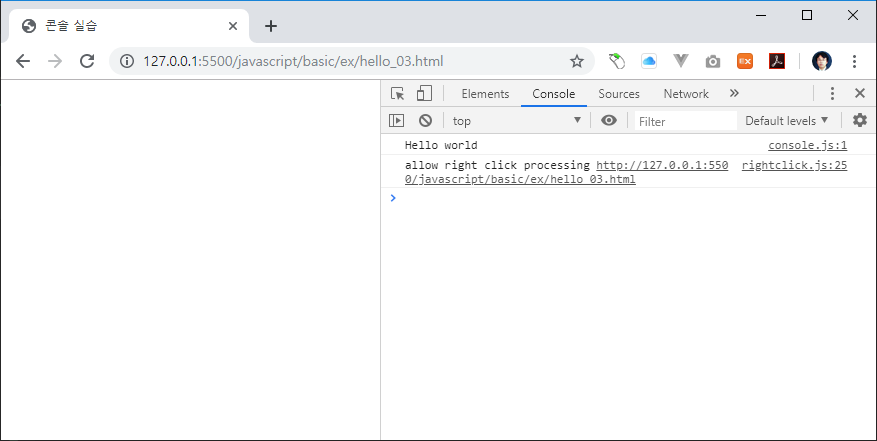

# 콘솔
자바스크립트를 이용하여 브라우저 화면에 `hello world`를 출력해 보았습니다.  

## 디버그
최근에는 자바스크립트의 동작이나 내용을 확인할때, 브라우저 화면 대신에 콘솔이라는 입출력 시스템을 활용하여 테스트 동작을 확인합니다.


## 핼로우 월드
콘솔에 `hello world`를 출력해 보도록 합니다.

```html
<!DOCTYPE html>
<html lang="ko">
<head>
    <title>콘솔 실습</title>
    <script src="console.js"></script>
</head>
<body>
    
</body>
</html>
```

`console.js` 파일을 작성합니다.

```javascript
console.log("Hello world");
```

브라우저에서 확인을 합니다.



브라우저 화면에는 아무런 내용이 출력되지 않습니다. `F12`번 키를 눌러 개발자 도구를 실행합니다.  
개발자 도구에서 `console`텝을 선택합니다.

콘솔텝에서 `hello world`문자열이 출력되는 것을 확인할 수 있습니다.


## 콘솔 메시지
콘솔은 자바스크립트에서 제공하는 `내장 객체` 입니다. 또한 콘솔은 5개의 메소드를 제공합니다.

다음과 같이 콘솔 메소드에 메시지를 입력하면, 입력된 메시지가 콘솔로 출력 됩니다.
```javascript
console.log(메시지);
```

콘솔은 프로그램의 동작을 디버그 하거나, 중간의 내용을 확인할때 매우 유용합니다.

### debug
```javascript
console.debug(메시지);
```

### error
```javascript
console.error(메시지);
```

### info
```javascript
console.info(메시지);
```

### warn
```javascript
console.warn(메시지);
```

## 메시지 필터링
웹 브라우저 콘솔에서 메시지를 필터링 합니다.

## 메시지 저장
로그를 파일로 저장합니다.

## 직접입력
브라우저 콘솔에서 직접 자바스크립트 코드를 작성하여 실행을 할 수도 있습니다.

브라우저 콘솔에서 다음과 같이 입력을 합니다.

```javascript
console.log("안녕하세요");
```


입력한 스크립트가 바로 해석되어 실행이 되는 것을 확인할 수 있습니다.
이처럼 콘솔을 이용하면 직접 자바스크립트 코드를 작성하지 않고도, 코드를 실행해 볼 수 있다는 장점이 있습니다.

