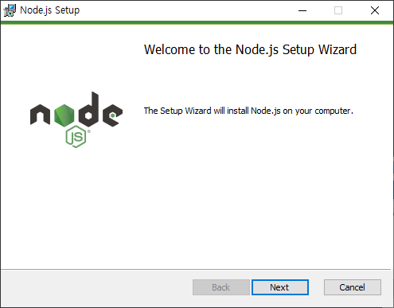
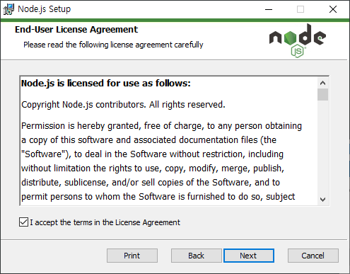
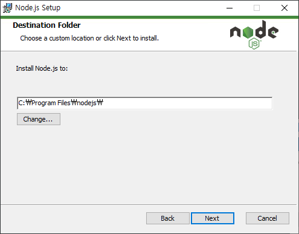
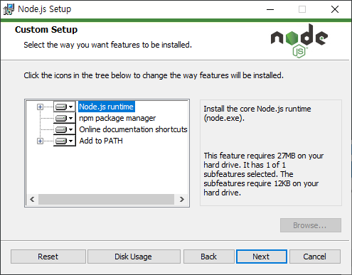
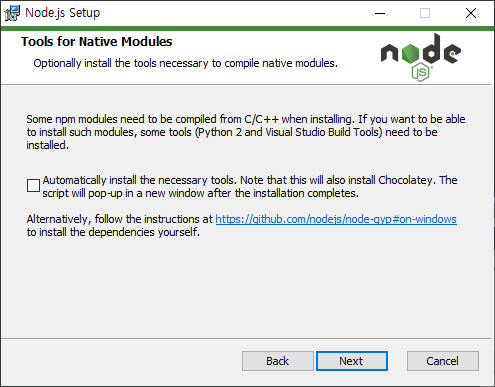
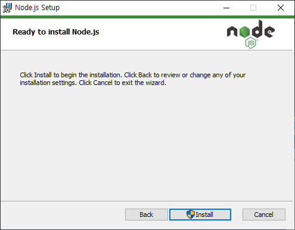
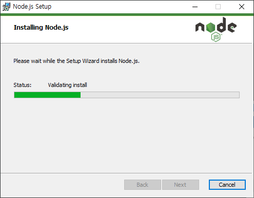
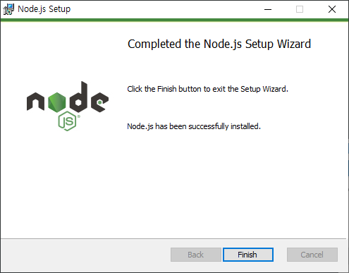

# node.js
---
`노드.js`는 자바스크립트를 이용하여 서버사이드 코드를 실행해 줍니다.


## 공식사이트 및 다운로드

공식 사이트 `https://nodejs.org`로 이동을 합니다. nodejs는 무료도 다운로드 받아 사용할 수 있는 오픈소스 입니다.


최신 버전의 nodejs를 다운로드 받습니다. nodejs는 2가지의 버젼을 제공합니다. LTS 와 최신 버젼 입니다.

>  LTS란?
>
> LTS는 장기 지원 버젼(long-term support)의 약자 입니다.  보통 버젼이 짝수일때 LTS 를 의미합니다.


## 윈도우에 설치하기

다운로드 받은 msi 실행 파일을 클릭합니다.


















## 맥에 설치하기

맥 운영체제 에서는 홈브루(brew)를 이용 설치 할 수 있다.

```
$ brew update
$ brew install node
```


## Linux에서 설치하기


## 설치 확인
---
콘솔을 실행합니다. `node` 명령어를 입력해 봅니다.

```
node -v
```

만일 콘솔에서 명령이 실행되지 않는 경우 환경 설정 path를 추개해 주시길 바랍니다.


## 코드실행
---

다음과 같이 `hello.js` 코드를 작성합니다.

```javascript
console.log('hello world');
```

작성한 코드를 콘솔에서 실행을 합니다.

```bash
$ node hello.js
hello world
```

콘솔로 출력되면 메시지가 터미널에서도 동일하게 실행이 되는 것을 확인 할 수 있습니다.